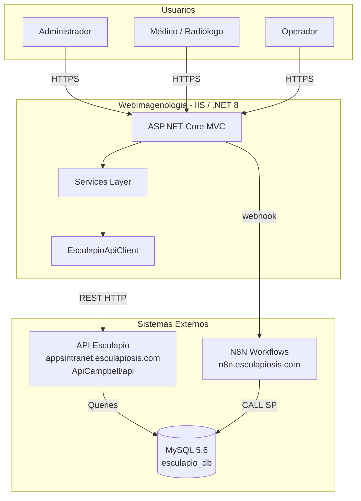
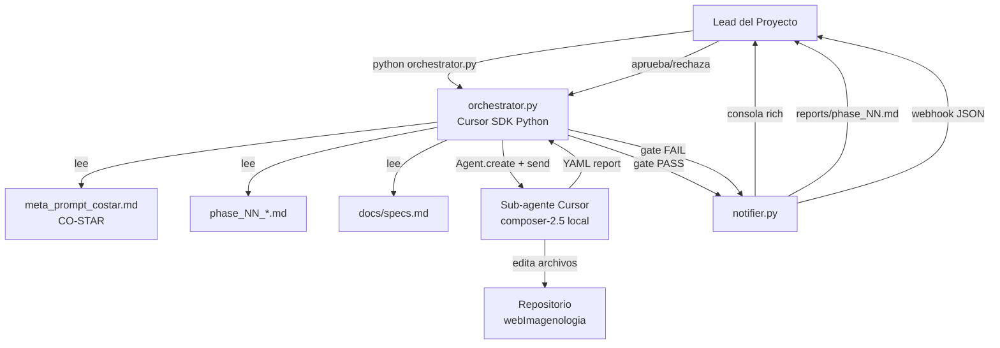
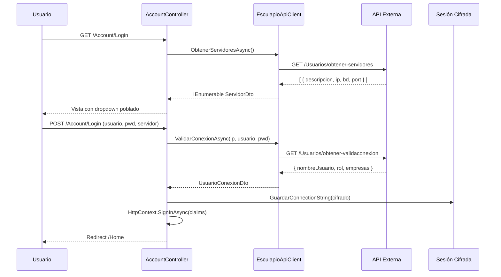
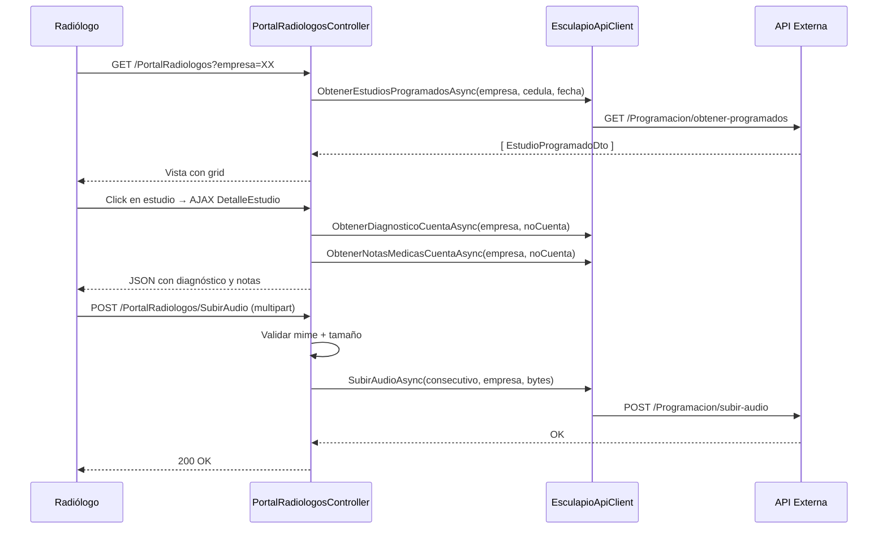
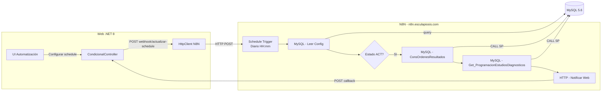
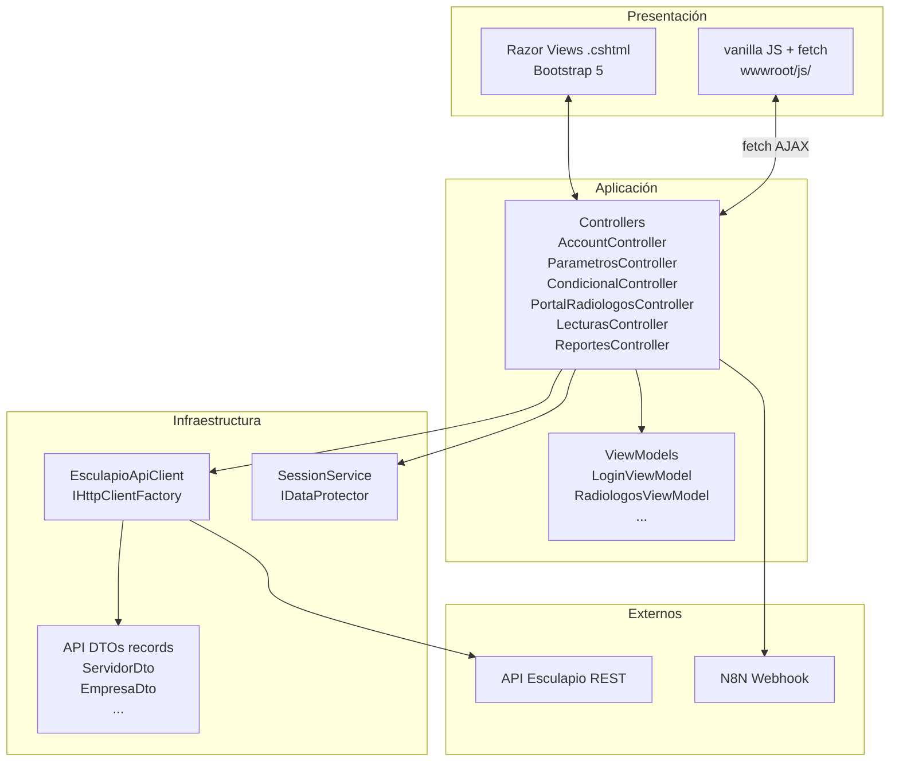

# architecture.md — Diagramas de Arquitectura
# Plataforma webImagenologia · Esculapio

---

## 1. Vista General del Sistema

---

## 2. Arquitectura del Pipeline Agentico

---

## 3. Flujo de Login

---

## 4. Flujo del Portal Radiólogos (Audio)

---

## 5. Flujo de Automatización N8N

---

## 6. Estructura de Capas (MVC)

